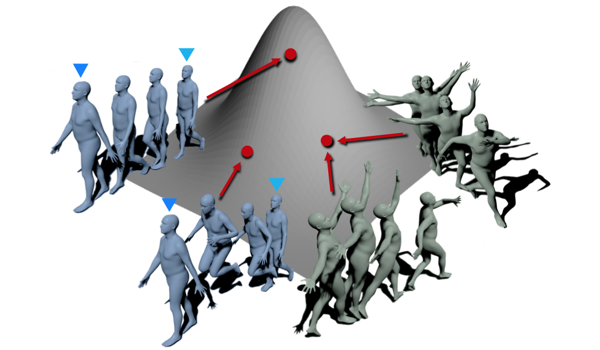

## Exploring Versatile Prior for Human Motion via Motion Frequency Guidance

<p>  </p>

[\[Video Demo\]](https://youtu.be/MLmCq0f-RP8)


## Installation
Requirements
- Python 3.6 
- PyTorch 1.1.0 

Please clone this repository and run the following command:
```bash
pip install -r requirements.txt
```
Then, download some checkpoints and human body models, and place them in the human_motion_prior/models.

Specifically, 
- Download the pretrained VPoser v1.0 model (2.5 MB) [here](https://smpl-x.is.tue.mpg.de/download.php). 
- Download the SMPLH model [here](https://mano.is.tue.mpg.de/downloads).
- Download the SMPL model [here](http://smpl.is.tue.mpg.de/download.php) for MALE and FEMALE and [here](https://smplify.is.tue.mpg.de/download.php) for NEUTRAL.
- Download the regressor weights files 1) *J_regressor_h36m.npy* and 2) *J_regressor_extra.npy* [here](http://visiondata.cis.upenn.edu/spin/data.tar.gz).

The models tree is like:
```bash
human_motion_prior/models
├── smpl
│   ├── SMPL_FEMALE.pkl
│   └── SMPL_MALE.pkl
│   └── SMPL_NEUTRAL.pkl
│   └── J_regressor_h36m.npy
│   └── J_regressor_extra.npy
├── smplh
│   ├── SMPLH_FEMALE_AMASS.npz
│   └── SMPLH_MALE_AMASS.npz
|   └── SMPLH_MEUTRAL_AMASS.npz
├── pre_trained
    └── vposer_v1_0
```

## Training
```bash
cd human_motion_prior/train
sh run_script.sh 4
```
We train our human motion prior on 4 GTX 1080Ti gpus with batch size 15 per gpu.

You can modify the human_motion_prior/train/motion_prior_defaults.ini for different training setting.

## Citation
```
@inproceedings{human_motion_prior,
  title = {Exploring Versatile Prior for Human Motion via Motion Frequency Guidance},
  author = {Jiachen Xu, Min Wang, Jingyu Gong, Wentao Liu, Chen Qian, Yuan Xie, Lizhuang Ma},
  booktitle = {2021 international conference on 3D vision (3DV)},
  year = {2021}
}
```


## Acknowledgments
We thank the authors of [VPoser](https://github.com/nghorbani/human_body_prior) for their released code.
